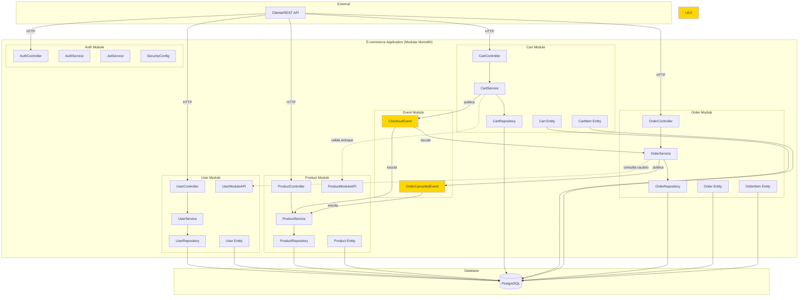
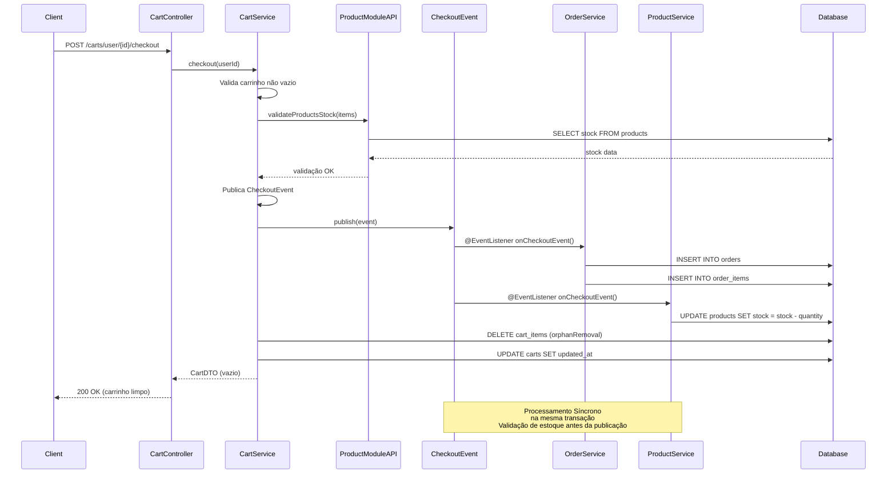
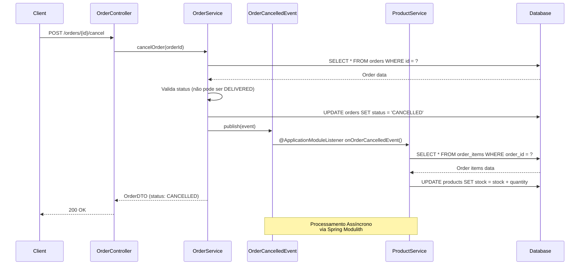
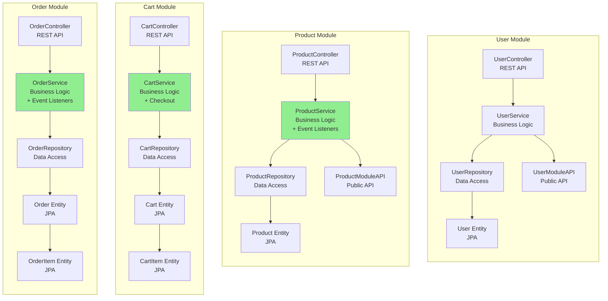
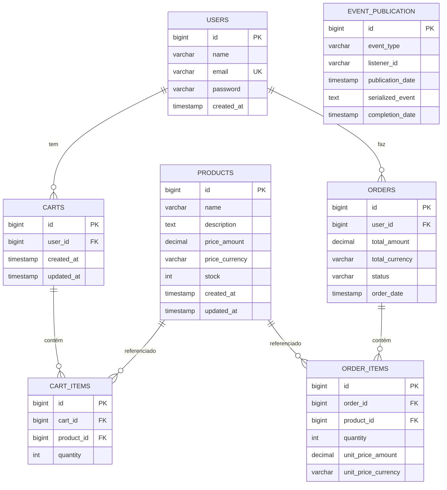
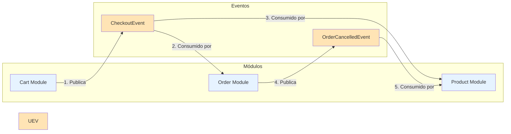
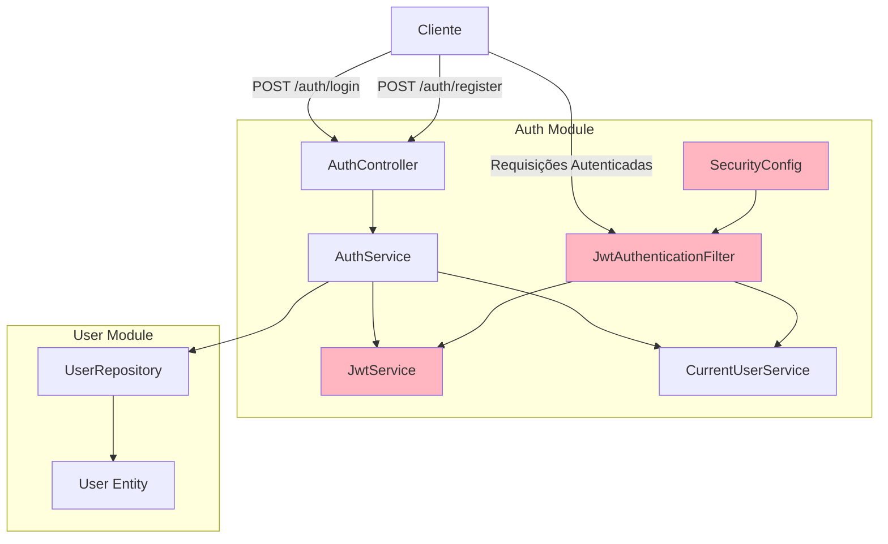
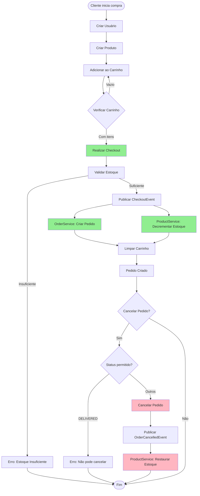
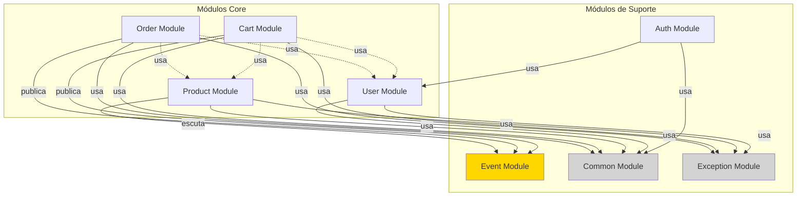
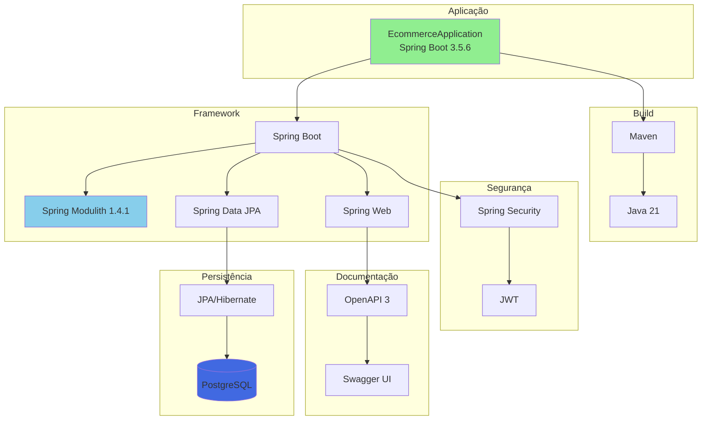

# 🏗️ Diagramas de Arquitetura - E-commerce Modular Monolith

Este documento contém diagramas Mermaid que modelam a arquitetura do sistema de e-commerce modular.

---

## 📊 1. Visão Geral da Arquitetura Modular

---

## 🔄 2. Fluxo de Checkout (Event-Driven)

---

## ❌ 3. Fluxo de Cancelamento de Pedido

---

## 🏛️ 4. Estrutura de Camadas por Módulo

---

## 🗄️ 5. Modelo de Dados (Database Schema)

---

## 📡 6. Comunicação entre Módulos via Eventos

---

## 🔐 7. Arquitetura de Segurança (Auth Module)

---

## 🎯 8. Fluxo Completo de Compra (End-to-End)

---

## 📦 9. Dependências entre Módulos

---

## 🔧 10. Stack Tecnológica

---

## 📝 Notas sobre os Diagramas

### Tipos de Comunicação

1. **Síncrona (REST API)**: Comunicação direta entre módulos via interfaces públicas (ModuleAPI)
2. **Event-Driven Síncrono**: Eventos processados na mesma transação usando `@EventListener`
3. **Event-Driven Assíncrono**: Eventos processados de forma assíncrona usando `@ApplicationModuleListener`

### Padrões Arquiteturais

- **Modular Monolith**: Aplicação monolítica organizada em módulos independentes
- **Event-Driven Architecture**: Comunicação via eventos de domínio
- **Domain-Driven Design**: Bounded contexts bem definidos
- **Repository Pattern**: Abstração de acesso a dados
- **DTO Pattern**: Transferência de dados entre camadas
- **Transactional Outbox**: Garantia de entrega de eventos

### Fluxos Principais

1. **Checkout**: Cart → CheckoutEvent → (Order + Product) - ambos consomem o mesmo evento
2. **Cancelamento**: Order → OrderCancelledEvent → Product
3. **Autenticação**: Client → AuthController → AuthService → UserRepository

**Nota sobre Checkout:** A validação de estoque ocorre antes da publicação do evento, garantindo segurança. Order e Product consomem o CheckoutEvent diretamente, simplificando a arquitetura.

---

**📚 Documentação gerada para E-commerce Modular Monolith**  
**🔄 Última atualização: Outubro 2025**

